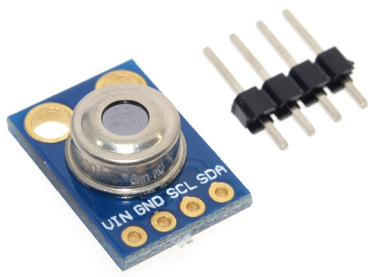

# MicroPython MLX90614

A MicroPython library for interfacing with a Melexis MLX90614 IR temperature sensor.

For example, the [GY-906 module](https://www.aliexpress.com/item/GY-906-MLX90614ESF-New-MLX90614-Contactless-Temperature-Sensor-Module-For-Arduino-Compatible/32474869821.html).



## Examples

Copy the file to your device, using ampy, webrepl or compiling and deploying. eg.

```bash
$ ampy put mlx90614.py
```

**Basic measurement**

```python
import mlx90614
from machine import I2C, Pin

i2c = I2C(scl=Pin(5), sda=Pin(4))
sensor = mlx90614.MLX90614(i2c)

print(sensor.read_ambient_temp())
print(sensor.read_object_temp())
if sensor.dual_zone:
    print(sensor.object2_temp)
```

**Continuous measurement**

```python
import time
import mlx90614
from machine import I2C, Pin

i2c = I2C(scl=Pin(5), sda=Pin(4))
sensor = mlx90614.MLX90614(i2c)

while True:
	print(sensor.read_ambient_temp(), sensor.read_object_temp())
	time.sleep_ms(500)
```

For full documentation see http://micropython-mlx90614.rtfd.io/.

## Parts

* [WeMos D1 Mini](https://www.aliexpress.com/store/product/D1-mini-Mini-NodeMcu-4M-bytes-Lua-WIFI-Internet-of-Things-development-board-based-ESP8266/1331105_32529101036.html) $3.50 USD
* [GY-906 module](https://www.aliexpress.com/item/GY-906-MLX90614ESF-New-MLX90614-Contactless-Temperature-Sensor-Module-For-Arduino-Compatible/32474869821.html) $4.05 USD

## Connections

WeMos D1 Mini | GY-906 module
------------- | ----------
D1 (GPIO5)    | SCL
D2 (GPIO4)    | SDA
3V3           | VCC
G             | GND

## Links

* [MLX90614 product page](https://www.melexis.com/en/product/MLX90614/Digital-Plug-Play-Infrared-Thermometer-TO-Can)
* [MLX90614 datasheet](https://www.melexis.com/-/media/files/documents/datasheets/mlx90614-datasheet-melexis.pdf)
* [WeMos D1 Mini](https://wiki.wemos.cc/products:d1:d1_mini)
* [micropython.org](http://micropython.org)
* [Adafruit Ampy](https://learn.adafruit.com/micropython-basics-load-files-and-run-code/install-ampy)

## License

Licensed under the [MIT License](http://opensource.org/licenses/MIT).
